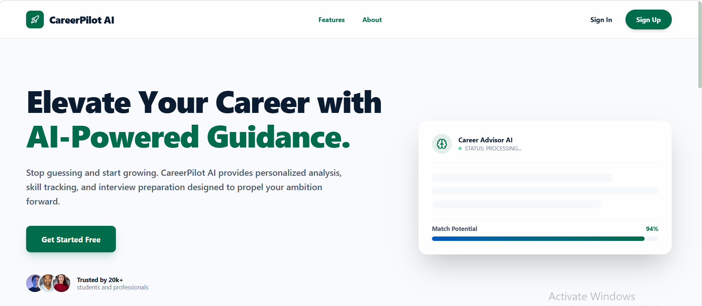
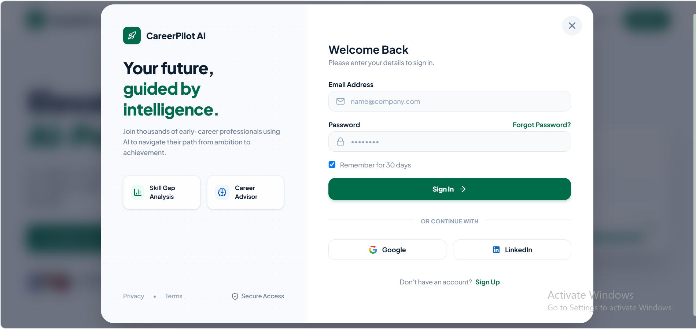
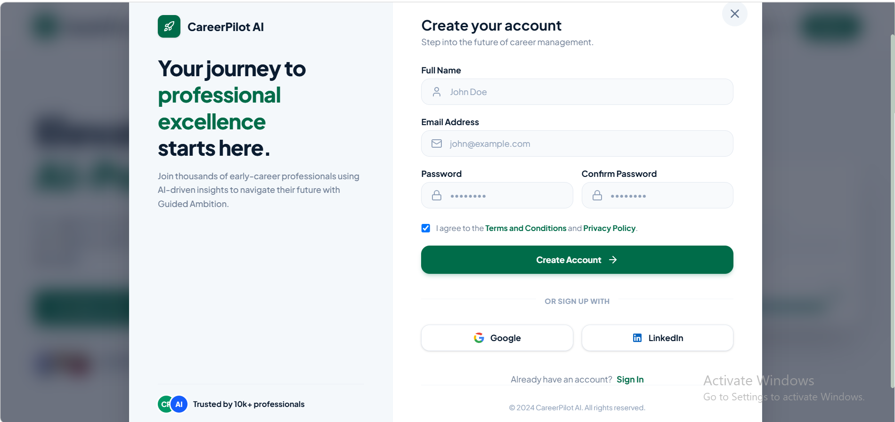
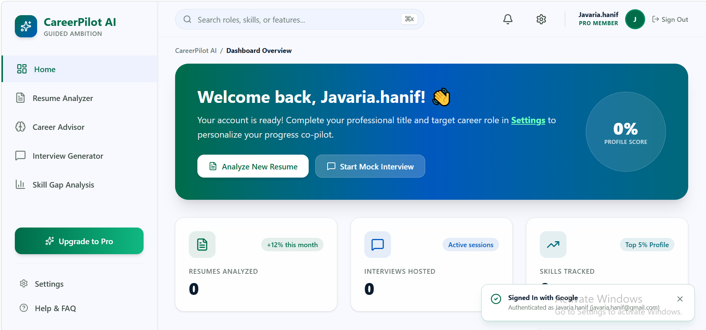
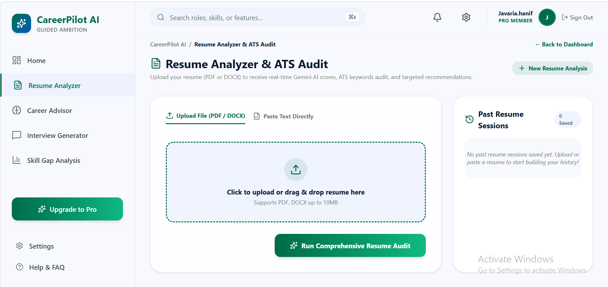
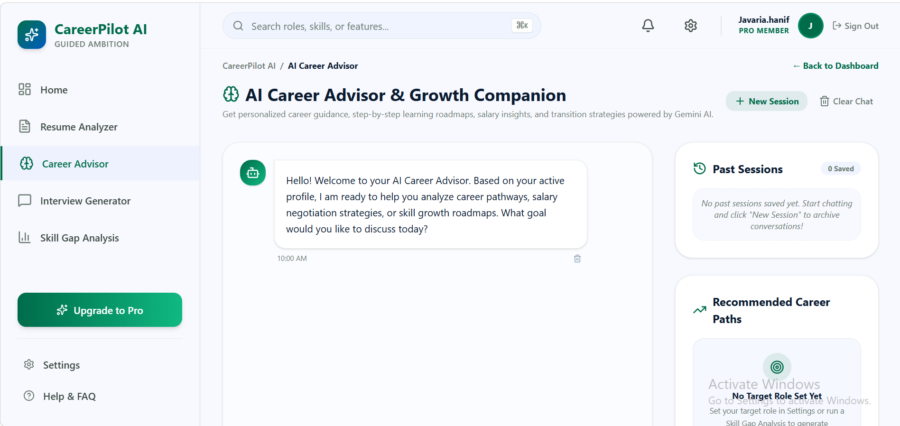
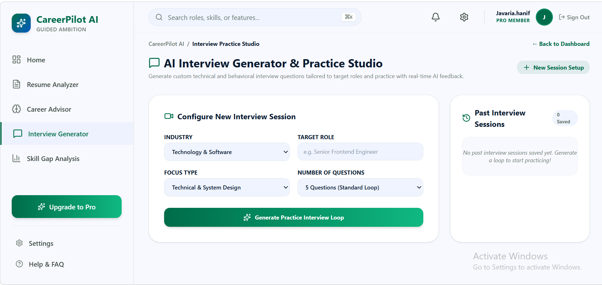
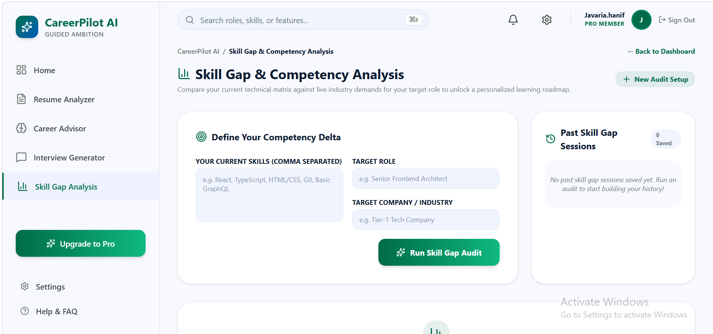

# CareerPilot AI

An AI-powered career guidance platform designed to help students and fresh graduates improve their employability through intelligent career support tools.

## Live Demo

**Live Application:** https://career-pilot-ai-rho-pink.vercel.app/

**GitHub Repository:** https://github.com/javaria11/CareerPilot-AI

---

## About the Project

Many students and fresh graduates struggle with resume writing, interview preparation, cover letter creation, and career planning. CareerPilot AI solves this problem by providing AI-powered career guidance in a single platform.

The application helps users analyse their resumes, identify missing skills, prepare for interviews, generate professional cover letters, and create personalised career roadmaps based on their career goals.

---

## Problem Statement

Students and job seekers often face challenges such as:

* Creating ATS-friendly resumes
* Writing professional cover letters
* Preparing for job interviews
* Identifying skill gaps
* Planning a clear career path

CareerPilot AI provides personalised AI-driven recommendations and guidance to help users become job-ready.

---

## Features

### Resume Analyzer

* Analyse resume content using AI
* Identify strengths and weaknesses
* Highlight missing skills
* Provide improvement suggestions
* Generate resume feedback

### Cover Letter Generator

* Create professional cover letters
* Customised according to job role and skills
* Ready-to-use content for job applications

### Interview Preparation

* Generate role-specific interview questions
* Provide sample answers
* Help users practice for interviews

### Career Roadmap Generator

* Generate personalised career roadmaps
* Suggest learning paths and milestones
* Provide guidance based on career goals

### Skill Gap Analysis

* Compare current skills with desired career requirements
* Identify areas for improvement
* Recommend learning objectives

### AI Career Advisor

* Interactive AI-powered career guidance
* Personalised career recommendations
* Professional development suggestions

---

## AI Feature

CareerPilot AI uses Google's Gemini AI model to analyse user input and generate personalised career guidance.

### AI Capabilities

* Resume evaluation and feedback
* Career recommendations
* Interview question generation
* Cover letter generation
* Skill gap analysis
* Career roadmap planning

### Example System Instructions

The AI is instructed to:

* Act as a professional career advisor
* Provide constructive and actionable feedback
* Suggest relevant skills and improvements
* Generate professional career-related content
* Offer personalised recommendations based on user input

---

## Technologies Used

### Frontend

* React
* TypeScript
* Vite
* HTML5
* CSS3

### Backend

* Node.js
* TypeScript

### AI & Development Tools

* Google Gemini AI
* Google AI Studio
* Google Stitch
* GitHub
* Vercel
* Visual Studio Code

---

## Screenshots

### Landing Page


### Sign In Page


### Sign Up Page


### Home Dashboard



### Resume Analyzer


### AI Career Advisor


### Interview Generator


### Skill Gap & Analysis


---

## Installation & Setup

### Clone the Repository

```bash
git clone https://github.com/javaria11/CareerPilot-AI.git
```

### Navigate to Project Folder

```bash
cd CareerPilot-AI
```

### Install Dependencies

```bash
npm install
```

### Run Development Server

```bash
npm run dev
```

### Open Application

```text
http://localhost:3000
```

---

## Project Structure

```text
CareerPilot-AI
│
├── src/
│   ├── components/
│   ├── views/
│   ├── data/
│   ├── utils/
│   ├── App.tsx
│   └── main.tsx
│
├── assets/
├── server.ts
├── package.json
├── vite.config.ts
└── README.md
```

---

## Deployment

The application is deployed on Vercel and publicly accessible at:

https://career-pilot-ai-rho-pink.vercel.app/

---

## Author

**Javaria**

